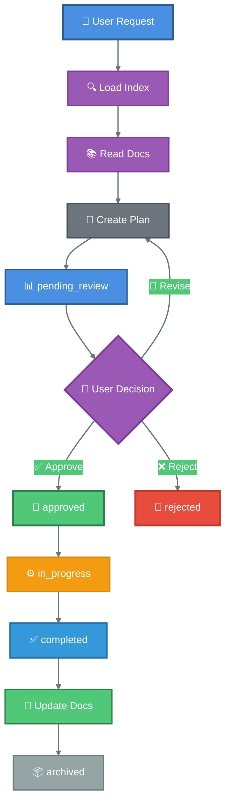
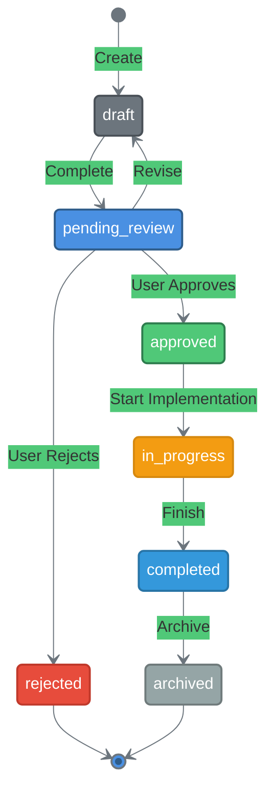

<div align="center">

# 🤖 Smart Copilot

### *Docs-First AI-Assisted Development with Human Control*

[](https://opensource.org/licenses/MIT)
[](https://github.com/neyrojasj/planning-copilot)
[](https://github.com/features/copilot)
[](standards/rust.md)
[](standards/nodejs.md)
[](standards/c.md)
[](standards/cpp.md)
[](standards/golang.md)
[](standards/python.md)

**A docs-first smart agent for GitHub Copilot that brings intentionality to AI-assisted development.**  
*Load index. Read docs. Plan first. Approve consciously. Implement with confidence. Update docs.*

[Quick Start](#-quick-start) • [Features](#-features) • [How It Works](#-how-it-works) • [Documentation](#-commands)

</div>

---

## ✨ Features

<table>
<tr>
<td width="33%" valign="top">

### 🔍 Docs-First Approach
Every execution starts by loading the search index. Navigate instantly to relevant documentation using keywords.

</td>
<td width="33%" valign="top">

### 📊 Intelligent Tracking
Complete lifecycle management: `draft` → `pending_review` → `approved` → `in_progress` → `completed` → `archived`

</td>
<td width="33%" valign="top">

### 🛡️ Best Practices
Built-in language standards for Rust, Node.js, C, C++, Go, and Python. Extensible for any language or framework.

</td>
</tr>
<tr>
<td width="33%" valign="top">

### 📚 Search Index
`index.yaml` serves as your navigation map—project identity, doc summaries, keywords, and cross-references.

</td>
<td width="33%" valign="top">

### 📁 Organized Docs
Single source of truth in `.copilot/docs/`. No duplication across files.

</td>
<td width="33%" valign="top">

### 🔗 GitHub Native
Seamlessly integrates with your existing `.github/` configurations and Copilot setup.

</td>
</tr>
</table>

---

## 🚀 Quick Start

### One-Command Installation

Choose your installation style:

<table>
<tr>
<td width="30%" align="center"><strong>🚀 Full Install</strong></td>
<td width="70%">

```bash
curl -sSL https://raw.githubusercontent.com/neyrojasj/planning-copilot/main/scripts/install.sh | bash
```
<sub>Includes standards (Rust, Node.js, C, C++, Go, Python) by default</sub>

</td>
</tr>
<tr>
<td width="30%" align="center"><strong>📦 No Standards</strong></td>
<td width="70%">

```bash
curl -sSL https://raw.githubusercontent.com/neyrojasj/planning-copilot/main/scripts/install.sh | bash -s -- --no-standards
```
<sub>Agent without language standards</sub>

</td>
</tr>
<tr>
<td width="30%" align="center"><strong>⚡ Minimal</strong></td>
<td width="70%">

```bash
curl -sSL https://raw.githubusercontent.com/neyrojasj/planning-copilot/main/scripts/install.sh | bash -s -- --minimal
```
<sub>Agent only, no extras</sub>

</td>
</tr>
</table>

### 📦 What Gets Installed

```
your-project/
├── .github/
│   ├── copilot-instructions.md  # 🤖 Auto-loads smart agent
│   └── agents/
│       └── smart.agent.md       # 🧠 The smart agent core
└── .copilot/
    ├── .gitignore               # 🔒 Keeps plans local
    ├── instructions.md          # 📝 Project-specific rules
    ├── docs/                    # 📚 Documentation (single source of truth)
    │   ├── index.yaml           # 🔍 Search index (load first!)
    │   ├── overview.md          # Project overview
    │   ├── architecture.md      # System architecture
    │   ├── tech-stack.md        # Languages, frameworks, deps
    │   ├── api.md               # API documentation
    │   ├── testing.md           # Testing strategy
    │   ├── development.md       # Dev workflow
    │   ├── conventions.md       # Code conventions
    │   └── decisions/           # 📐 Design decisions (ADRs)
    │       ├── index.yaml       # Decision index
    │       └── ADR-XXX.md       # Individual decisions
    ├── standards/               # 🛡️ Best practices (optional)
    │   ├── general.md           # Universal principles
    │   ├── rust.md              # Rust standards
    │   ├── nodejs.md            # Node.js standards
    │   ├── c.md                 # C standards
    │   ├── cpp.md               # C++ standards
    │   ├── golang.md            # Go standards
    │   └── python.md            # Python standards
    ├── plans/
    │   ├── state.yaml           # 📈 Plan tracking
    │   └── PLAN-XXX.md          # 📋 Individual plans
    ├── prompts/                 # 🎯 Setup prompts
    │   └── setup-project.md     # Project setup prompt
    └── tmp/                     # 🗑️ Temporary files
```

---

## 🧠 How It Works

### 🎬 Docs-First Intelligence

The `copilot-instructions.md` ensures the Smart Agent is **automatically loaded** by default. Every execution starts with loading `index.yaml`—your navigation map to project documentation.

### 🏁 First Run Initialization

When you first invoke the smart agent, it performs these steps:

<div align="center">

<table>
<tr>
<td width="10%" align="center">1️⃣</td>
<td width="90%">
<strong>Load Search Index</strong><br/>
<sub>Reads <code>.copilot/docs/index.yaml</code> for keywords and doc summaries</sub>
</td>
</tr>
<tr>
<td width="10%" align="center">2️⃣</td>
<td width="90%">
<strong>Navigate to Relevant Docs</strong><br/>
<sub>Uses keywords to find documentation matching the task</sub>
</td>
</tr>
<tr>
<td width="10%" align="center">3️⃣</td>
<td width="90%">
<strong>Read Custom Instructions</strong><br/>
<sub>Loads project-specific rules from <code>.copilot/instructions.md</code></sub>
</td>
</tr>
<tr>
<td width="10%" align="center">4️⃣</td>
<td width="90%">
<strong>Check Plan Status</strong><br/>
<sub>Reviews <code>.copilot/plans/state.yaml</code> for pending work</sub>
</td>
</tr>
<tr>
<td width="10%" align="center">5️⃣</td>
<td width="90%">
<strong>Ready to Plan</strong><br/>
<sub>Agent is now fully initialized and ready to create plans</sub>
</td>
</tr>
</table>

</div>

### 🔄 Planning Workflow



### ⚠️ Human-in-the-Loop Approval

The agent **NEVER** implements changes autonomously:

<div align="center">

```
┌─────────────────────────────────────────────────────────┐
│ 📋 Plan Ready for Review                                │
├─────────────────────────────────────────────────────────┤
│                                                         │
│ I've created a plan for: Add user authentication       │
│                                                         │
│ 📝 Summary:                                             │
│ • Implement JWT-based authentication                   │
│ • Add login/logout endpoints                           │
│ • Create middleware for protected routes               │
│                                                         │
│ 📁 Files affected:                                      │
│ • src/auth/mod.rs (create)                             │
│ • src/middleware/auth.rs (create)                      │
│ • src/routes/auth.rs (create)                          │
│ • Cargo.toml (modify)                                  │
│                                                         │
│ 🔍 Review full plan: .copilot/plans/PLAN-001.md        │
│                                                         │
│ ┌─────────────────────────────────────────────────┐   │
│ │ ⚡ Your Decision Required                       │   │
│ │                                                 │   │
│ │ ✅ "approve" or "yes" → Proceed                 │   │
│ │ ❌ "reject" or "no" → Cancel                    │   │
│ │ 📝 "revise" + feedback → Modify                 │   │
│ └─────────────────────────────────────────────────┘   │
└─────────────────────────────────────────────────────────┘
```

</div>

---

## 📚 Commands

Interact with the `@smart` agent using these commands:

<table>
<thead>
<tr>
<th width="35%">Command</th>
<th width="65%">Description</th>
</tr>
</thead>
<tbody>
<tr>
<td><code>plan new &lt;description&gt;</code></td>
<td>🆕 Create a new plan with the given description</td>
</tr>
<tr>
<td><code>plan list</code></td>
<td>📋 Display all plans with their current statuses</td>
</tr>
<tr>
<td><code>plan approve &lt;ID&gt;</code></td>
<td>✅ Approve a plan and mark it ready for implementation</td>
</tr>
<tr>
<td><code>plan implement &lt;ID&gt;</code></td>
<td>⚙️ Begin implementing an approved plan</td>
</tr>
<tr>
<td><code>docs update</code></td>
<td>📖 Update documentation after changes</td>
</tr>
<tr>
<td><code>docs rebuild</code></td>
<td>🔄 Rebuild the search index from all docs</td>
</tr>
</tbody>
</table>

---

## 🔄 Plan States

<div align="center">



</div>

| State | Icon | Description |
|-------|------|-------------|
| `draft` | 📝 | Plan is being created, not ready for review |
| `pending_review` | 👀 | Plan is complete and awaiting user approval |
| `approved` | ✅ | User approved—ready for implementation |
| `in_progress` | ⚙️ | Currently being implemented by agent |
| `completed` | ✔️ | Successfully implemented and working |
| `archived` | 📦 | Completed and archived for reference |
| `rejected` | ❌ | User rejected—will not be implemented |

---

## 📊 State Tracking

All plans are tracked in `.copilot/plans/state.yaml` with complete metadata:

```yaml
version: 1
last_updated: "2024-01-20T10:30:00Z"

plans:
  PLAN-001:
    title: "Add user authentication"
    status: completed
    created: "2024-01-15"
    updated: "2024-01-20"
    
  PLAN-002:
    title: "Refactor database layer"
    status: pending_review
    created: "2024-01-18"
    updated: "2024-01-18"

summary:
  draft: 0
  pending_review: 1
  approved: 0
  in_progress: 0
  completed: 1
  archived: 0
  rejected: 0
```

---

## 🛡️ Language Standards

When installed with `--with-standards`, enforce best practices automatically:

### 🌍 General Standards (`standards/general.md`)

**Universal principles that apply to ALL languages:**

<table>
<tr>
<td>

- ❌ **No default environment variables**  
  <sub>Missing config must fail at startup</sub>
  
- ❌ **No silent error swallowing**  
  <sub>All errors handled or propagated</sub>

</td>
<td>

- ❌ **No catch-all defaults**  
  <sub>Pattern matching must be exhaustive</sub>
  
- ❌ **No unsafe unwrapping**  
  <sub>Always use `.expect()` with reason</sub>

</td>
<td>

- ⚡ **Fail fast, fail loud**  
  <sub>Bugs caught in dev, not production</sub>
  
- 🧪 **Test-driven approach**  
  <sub>Write tests for new features</sub>

</td>
</tr>
</table>

### 🦀 Rust Standards (`standards/rust.md`)

<details>
<summary><strong>📦 Project Structure, Error Handling, Testing & More</strong></summary>

- **Project structure conventions** for workspace and crate organization
- **Error handling** with `thiserror` and `anyhow`
- **Memory management** and performance guidelines
- **Clippy lints** configuration for strict code quality
- **Testing patterns** with unit, integration, and doc tests
- **Concurrency** best practices with async/await

</details>

### 💚 Node.js Standards (`standards/nodejs.md`)
 
 <details>
 <summary><strong>📦 TypeScript, ESLint, Security & Testing</strong></summary>
 
 - **TypeScript** strict configuration and best practices
 - **ESLint** and **Prettier** setup for code consistency
 - **Error handling** patterns for async operations
 - **Security** best practices (no eval, sanitize inputs, etc.)
 - **Testing** with Vitest/Jest, including coverage requirements
 - **Performance** optimization patterns
 
 </details>
 
 ### 🔵 C Standards (`standards/c.md`)
 
 <details>
 <summary><strong>📦 Memory Management, Pointer Safety & Error Handling</strong></summary>
 
 - **Memory management** (malloc/free patterns, avoiding leaks)
 - **Pointer safety** and NULL pointer checks
 - **C23 standard** features and compatibility
 - **Error handling** patterns (return codes, errno)
 - **Header file** best practices and include guards
 
 </details>
 
 ### 🔵 C++ Standards (`standards/cpp.md`)
 
 <details>
 <summary><strong>📦 RAII, Smart Pointers, C++20/23 & STL</strong></summary>
 
 - **RAII and Resource Management** (smart pointers, move semantics)
 - **Modern C++ Features** (C++17, C++20, C++23)
 - **STL Usage** (containers, algorithms, views)
 - **Concepts** for template constraints
 - **Concurrency** best practices
 
 </details>
 
 ### 🔵 Go Standards (`standards/golang.md`)
 
 <details>
 <summary><strong>📦 Effective Go, Error Handling & Concurrency</strong></summary>
 
 - **Effective Go** principles (simplicity, readability)
 - **Error handling** (explicit checks, wrapping)
 - **Concurrency** (goroutines, channels, sync primitives)
 - **Package design** and project structure
 - **Testing patterns** (table-driven tests)
 
 </details>
 
 ### 🔵 Python Standards (`standards/python.md`)
 
 <details>
 <summary><strong>📦 PEP 8, Type Hints, Modern Tooling & Testing</strong></summary>
 
 - **PEP 8** style guide and layout
 - **Type hints** and static analysis with mypy
 - **Modern tooling** (ruff, black, pydantic)
 - **Error handling** and context managers
 - **Testing** with pytest and coverage
 
 </details>

### ➕ Extensible for Any Language

Add your own standards in `.copilot/standards/`:

```
 .copilot/standards/
 ├── general.md      # Universal principles
 ├── rust.md         # Built-in
 ├── nodejs.md       # Built-in
 ├── c.md            # Built-in
 ├── cpp.md          # Built-in
 ├── golang.md       # Built-in
 ├── python.md       # Built-in
 └── java.md         # ← Add yours
 ```

---

## ⚙️ Customization

### 📝 Project-Specific Instructions

Tailor the planning agent to your project by editing `.copilot/instructions.md`:

```markdown
## Custom Rules
- ✅ Always use TypeScript strict mode
- 🎨 Follow existing code style in the project
- 🧪 Include tests for all new features
- 📖 Update documentation for API changes

## Preferences
- 📋 Create small, focused plans (max 5 files)
- 🔗 Reference relevant documentation
- 💬 Use conventional commit messages
- ⚡ Prefer performance over convenience where applicable
```

### 🆕 Adding New Standards

Extend with your own language or framework standards:

```bash
# Create a new standard file
touch .copilot/standards/python.md
```

Example `python.md`:

```markdown
# Python Standards

## Project Structure
- Use `pyproject.toml` for dependencies
- Follow PEP 8 style guide
- Type hints required for all functions

## Error Handling
- Use custom exceptions for domain errors
- Always handle exceptions explicitly
- No bare `except:` clauses

## Testing
- pytest for all tests
- 90%+ code coverage required
- Use fixtures for test data
```

---

## 🗂️ Repository Structure

```
planning-copilot/
├── 📄 README.md                 # You are here
├── 📄 LICENSE                   # MIT License
├── agents/
│   └── smart.agent.md           # 🧠 Main smart agent (YAML frontmatter)
├── standards/
│   ├── general.md               # 🌍 Universal principles
│   ├── rust.md                  # 🦀 Rust best practices
│   ├── nodejs.md                # 💚 Node.js best practices
│   ├── c.md                     # 🔵 C best practices
│   ├── cpp.md                   # 🔵 C++ best practices
│   ├── golang.md                # 🔵 Go best practices
│   └── python.md                # 🔵 Python best practices
├── scripts/
│   ├── install.sh               # 🚀 Main installer
│   ├── install-with-standards.sh  # 📚 With standards
│   └── install-minimal.sh       # ⚡ Minimal setup
└── templates/
    ├── copilot-instructions.md  # 🤖 Default Copilot config
    ├── instructions-template.md # 📝 Instructions template
    ├── plan-template.md         # 📋 Plan file template
    ├── project-summary-template.md  # 📊 Quick reference template
    ├── state.yaml               # 🔄 Plans state template
    └── docs/                    # 📚 Documentation templates
        ├── index.yaml           # 🔍 Search index template
        ├── overview.md          # Project overview template
        ├── architecture.md      # Architecture template
        ├── tech-stack.md        # Tech stack template
        ├── api.md               # API docs template
        ├── testing.md           # Testing template
        ├── development.md       # Development template
        ├── conventions.md       # Conventions template
        └── decisions/           # 📐 Decision templates
            ├── index.yaml       # Decision index template
            └── template.md      # ADR template
```

---

## 🤖 Agent Configuration

The smart agent uses VS Code's custom agent format with **YAML frontmatter**:

```yaml
---
description: Docs-first agent that plans, tracks, and implements code changes.
name: Smart
tools: ['fetch', 'githubRepo', 'search', 'usages']
handoffs:
  - label: Setup Project
    agent: agent
    prompt: "Initialize project documentation..."
    send: false
  - label: Rebuild Search Index
    agent: agent
    prompt: "Rebuild the search index..."
    send: false
---
```

### 🔀 Agent Handoffs

Seamlessly transition between specialized agents:

| From | To | Purpose |
|------|-----|---------|
| **Smart Agent** | Default Agent | Implement approved plans |
| **Smart Agent** | Custom Agent | Specialized implementation |

---

## 🔒 Privacy & Gitignore

By default, plans and temporary files stay **local** and are not committed to git:

```gitignore
# .copilot/.gitignore
tmp/        # Temporary files
plans/      # All plan files (comment out to track in git)
```

> **💡 Tip:** Want to version-control your plans? Remove `plans/` from `.copilot/.gitignore`

---

## 🤝 Contributing

We welcome contributions! Here's how to get started:

1. 🍴 **Fork** the repository
2. 🌱 **Create** a feature branch (`git checkout -b feature/amazing-improvement`)
3. 💻 **Make** your changes with clear commit messages
4. ✅ **Test** your changes thoroughly
5. 📤 **Submit** a pull request

### 💡 Ideas for Contributions

- 📚 Add standards for more languages (Java, PHP, Ruby, etc.)
- 🎨 Improve installation scripts
- 📖 Enhance documentation with examples
- 🐛 Report bugs or suggest features
- 🌍 Add internationalization support

---

## 📄 License

**MIT License** - See [LICENSE](LICENSE) for details.

---

## 🌟 Why Smart Copilot?

<div align="center">

> *"The best code is well-documented code. Smart Copilot ensures AI assistance enhances your decision-making with docs-first approach rather than replacing it."*

### Made with ❤️ for developers who value intentionality in the AI era

[](https://github.com/neyrojasj/planning-copilot)
[](https://github.com/neyrojasj)

</div>
