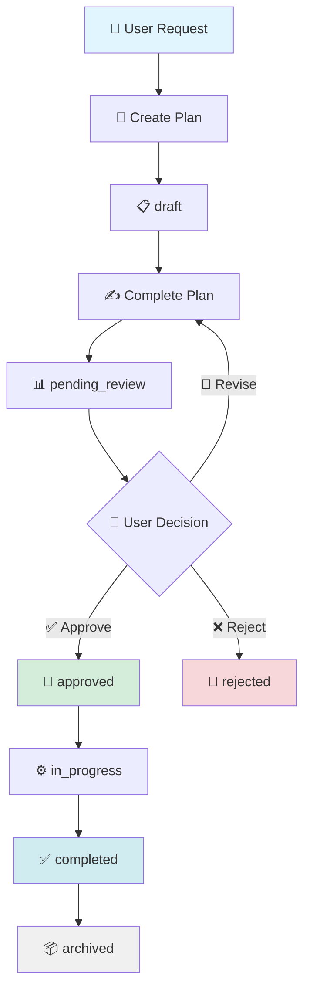
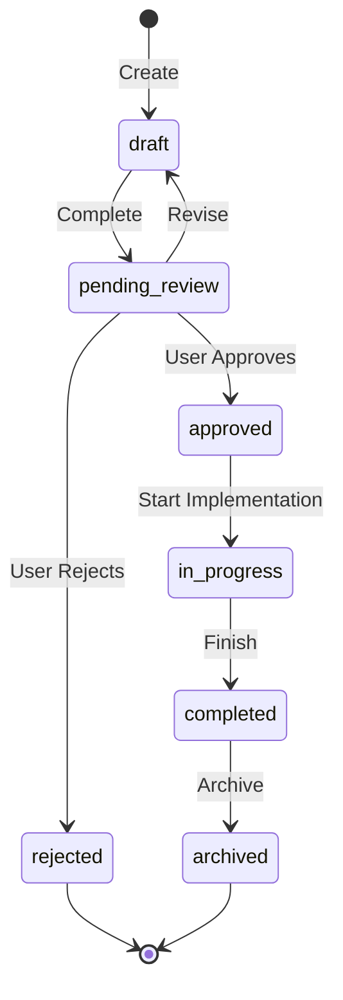

<div align="center">

# 🤖 Planning Copilot

### *Thoughtful AI-Assisted Development with Human Control*

[](https://opensource.org/licenses/MIT)
[](https://github.com/neyrojasj/planning-copilot)
[](https://github.com/features/copilot)
[](standards/rust.md)
[](standards/nodejs.md)

**A structured planning agent for GitHub Copilot that brings intentionality to AI-assisted development.**  
*Plan first. Approve consciously. Implement with confidence.*

[Quick Start](#-quick-start) • [Features](#-features) • [How It Works](#-how-it-works) • [Documentation](#-commands)

</div>

---

## ✨ Features

<table>
<tr>
<td width="33%" valign="top">

### 🎯 Structured Planning
Never let AI implement changes without your explicit approval. Every code change starts with a plan you review and approve.

</td>
<td width="33%" valign="top">

### 📊 Intelligent Tracking
Complete lifecycle management: `draft` → `pending_review` → `approved` → `in_progress` → `completed` → `archived`

</td>
<td width="33%" valign="top">

### 🛡️ Best Practices
Built-in language standards for Rust and Node.js. Extensible for any language or framework.

</td>
</tr>
<tr>
<td width="33%" valign="top">

### 🔍 Project Analysis
Automatically understands your project structure, coding standards, and existing configurations on first run.

</td>
<td width="33%" valign="top">

### 📁 Organized Storage
Clean separation: all plans in `.copilot/plans/`, tracked via YAML state management.

</td>
<td width="33%" valign="top">

### 🔗 GitHub Native
Seamlessly integrates with your existing `.github/` configurations and Copilot setup.

</td>
</tr>
</table>

---

## 🚀 Quick Start

### One-Command Installation

Choose your installation style:

<table>
<tr>
<td width="30%" align="center"><strong>🎨 Interactive</strong></td>
<td width="70%">

```bash
curl -sSL https://raw.githubusercontent.com/neyrojasj/planning-copilot/main/scripts/install.sh | bash
```
<sub>Prompts for options</sub>

</td>
</tr>
<tr>
<td width="30%" align="center"><strong>📚 With Standards</strong></td>
<td width="70%">

```bash
curl -sSL https://raw.githubusercontent.com/neyrojasj/planning-copilot/main/scripts/install.sh | bash -s -- --with-standards
```
<sub>Includes Rust & Node.js best practices</sub>

</td>
</tr>
<tr>
<td width="30%" align="center"><strong>⚡ Minimal</strong></td>
<td width="70%">

```bash
curl -sSL https://raw.githubusercontent.com/neyrojasj/planning-copilot/main/scripts/install.sh | bash -s -- --minimal
```
<sub>Agent only, no extras</sub>

</td>
</tr>
</table>

### 📦 What Gets Installed

```
your-project/
├── .github/
│   ├── copilot-instructions.md  # 🤖 Auto-loads planning agent
│   └── agents/
│       └── planning.agent.md    # 🧠 The planning agent core
└── .copilot/
    ├── .gitignore               # 🔒 Keeps plans local
    ├── instructions.md          # 📝 Project-specific rules
    ├── project_summary.md       # 📊 Auto-generated analysis
    ├── standards/               # 🛡️ Best practices (optional)
    │   ├── general.md           # Universal principles
    │   ├── rust.md              # Rust standards
    │   └── nodejs.md            # Node.js standards
    ├── plans/
    │   ├── state.yaml           # 📈 Plan tracking
    │   └── PLAN-XXX.md          # 📋 Individual plans
    └── tmp/                     # 🗑️ Temporary files
```

---

## 🧠 How It Works

### 🎬 Auto-Loading Intelligence

The `copilot-instructions.md` ensures the Planning Agent is **automatically loaded** by default—guaranteeing every code change flows through the intentional planning workflow.

### 🏁 First Run Initialization

When you first invoke the planning agent, it performs these steps:

<table>
<tr>
<td width="10%" align="center">1️⃣</td>
<td width="90%">
<strong>Check for Project Summary</strong><br/>
<sub>Verifies if <code>.copilot/project_summary.md</code> exists</sub>
</td>
</tr>
<tr>
<td width="10%" align="center">2️⃣</td>
<td width="90%">
<strong>Analyze Project Structure</strong><br/>
<sub>If summary doesn't exist, scans your codebase and generates insights</sub>
</td>
</tr>
<tr>
<td width="10%" align="center">3️⃣</td>
<td width="90%">
<strong>Read Custom Instructions</strong><br/>
<sub>Loads project-specific rules from <code>.copilot/instructions.md</code></sub>
</td>
</tr>
<tr>
<td width="10%" align="center">4️⃣</td>
<td width="90%">
<strong>Scan GitHub Configuration</strong><br/>
<sub>Discovers existing Copilot configurations in <code>.github/</code> folder</sub>
</td>
</tr>
<tr>
<td width="10%" align="center">5️⃣</td>
<td width="90%">
<strong>Ready to Plan</strong><br/>
<sub>Agent is now fully initialized and ready to create plans</sub>
</td>
</tr>
</table>

### 🔄 Planning Workflow



### ⚠️ Human-in-the-Loop Approval

The agent **NEVER** implements changes autonomously:

<div align="center">

```
┌─────────────────────────────────────────────────────────┐
│ 📋 Plan Ready for Review                                │
├─────────────────────────────────────────────────────────┤
│                                                         │
│ I've created a plan for: Add user authentication       │
│                                                         │
│ 📝 Summary:                                             │
│ • Implement JWT-based authentication                   │
│ • Add login/logout endpoints                           │
│ • Create middleware for protected routes               │
│                                                         │
│ 📁 Files affected:                                      │
│ • src/auth/mod.rs (create)                             │
│ • src/middleware/auth.rs (create)                      │
│ • src/routes/auth.rs (create)                          │
│ • Cargo.toml (modify)                                  │
│                                                         │
│ 🔍 Review full plan: .copilot/plans/PLAN-001.md        │
│                                                         │
│ ┌─────────────────────────────────────────────────┐   │
│ │ ⚡ Your Decision Required                       │   │
│ │                                                 │   │
│ │ ✅ "approve" or "yes" → Proceed                 │   │
│ │ ❌ "reject" or "no" → Cancel                    │   │
│ │ 📝 "revise" + feedback → Modify                 │   │
│ └─────────────────────────────────────────────────┘   │
└─────────────────────────────────────────────────────────┘
```

</div>

---

## 📚 Commands

Interact with the `@planning` agent using these commands:

<table>
<thead>
<tr>
<th width="35%">Command</th>
<th width="65%">Description</th>
</tr>
</thead>
<tbody>
<tr>
<td><code>plan new &lt;description&gt;</code></td>
<td>🆕 Create a new plan with the given description</td>
</tr>
<tr>
<td><code>plan list</code></td>
<td>📋 Display all plans with their current statuses</td>
</tr>
<tr>
<td><code>plan show &lt;ID&gt;</code></td>
<td>🔍 View detailed information for a specific plan</td>
</tr>
<tr>
<td><code>plan approve &lt;ID&gt;</code></td>
<td>✅ Approve a plan and mark it ready for implementation</td>
</tr>
<tr>
<td><code>plan reject &lt;ID&gt;</code></td>
<td>❌ Reject a plan and prevent implementation</td>
</tr>
<tr>
<td><code>plan implement &lt;ID&gt;</code></td>
<td>⚙️ Begin implementing an approved plan</td>
</tr>
<tr>
<td><code>plan archive &lt;ID&gt;</code></td>
<td>📦 Archive a completed plan for future reference</td>
</tr>
<tr>
<td><code>plan status</code></td>
<td>📊 Show summary dashboard of all plans by status</td>
</tr>
</tbody>
</table>

---

## 🔄 Plan States

<div align="center">



</div>

| State | Icon | Description |
|-------|------|-------------|
| `draft` | 📝 | Plan is being created, not ready for review |
| `pending_review` | 👀 | Plan is complete and awaiting user approval |
| `approved` | ✅ | User approved—ready for implementation |
| `in_progress` | ⚙️ | Currently being implemented by agent |
| `completed` | ✔️ | Successfully implemented and working |
| `archived` | 📦 | Completed and archived for reference |
| `rejected` | ❌ | User rejected—will not be implemented |

---

## 📊 State Tracking

All plans are tracked in `.copilot/plans/state.yaml` with complete metadata:

```yaml
version: 1
last_updated: "2024-01-20T10:30:00Z"

plans:
  PLAN-001:
    title: "Add user authentication"
    status: completed
    created: "2024-01-15"
    updated: "2024-01-20"
    
  PLAN-002:
    title: "Refactor database layer"
    status: pending_review
    created: "2024-01-18"
    updated: "2024-01-18"

summary:
  draft: 0
  pending_review: 1
  approved: 0
  in_progress: 0
  completed: 1
  archived: 0
  rejected: 0
```

---

## 🛡️ Language Standards

When installed with `--with-standards`, enforce best practices automatically:

### 🌍 General Standards (`standards/general.md`)

**Universal principles that apply to ALL languages:**

<table>
<tr>
<td>

- ❌ **No default environment variables**  
  <sub>Missing config must fail at startup</sub>
  
- ❌ **No silent error swallowing**  
  <sub>All errors handled or propagated</sub>

</td>
<td>

- ❌ **No catch-all defaults**  
  <sub>Pattern matching must be exhaustive</sub>
  
- ❌ **No unsafe unwrapping**  
  <sub>Always use `.expect()` with reason</sub>

</td>
<td>

- ⚡ **Fail fast, fail loud**  
  <sub>Bugs caught in dev, not production</sub>
  
- 🧪 **Test-driven approach**  
  <sub>Write tests for new features</sub>

</td>
</tr>
</table>

### 🦀 Rust Standards (`standards/rust.md`)

<details>
<summary><strong>📦 Project Structure, Error Handling, Testing & More</strong></summary>

- **Project structure conventions** for workspace and crate organization
- **Error handling** with `thiserror` and `anyhow`
- **Memory management** and performance guidelines
- **Clippy lints** configuration for strict code quality
- **Testing patterns** with unit, integration, and doc tests
- **Concurrency** best practices with async/await

</details>

### 💚 Node.js Standards (`standards/nodejs.md`)

<details>
<summary><strong>📦 TypeScript, ESLint, Security & Testing</strong></summary>

- **TypeScript** strict configuration and best practices
- **ESLint** and **Prettier** setup for code consistency
- **Error handling** patterns for async operations
- **Security** best practices (no eval, sanitize inputs, etc.)
- **Testing** with Vitest/Jest, including coverage requirements
- **Performance** optimization patterns

</details>

### ➕ Extensible for Any Language

Add your own standards in `.copilot/standards/`:

```
.copilot/standards/
├── general.md      # Universal principles
├── rust.md         # Built-in
├── nodejs.md       # Built-in
├── python.md       # ← Add yours
├── golang.md       # ← Add yours
└── java.md         # ← Add yours
```

---

## ⚙️ Customization

### 📝 Project-Specific Instructions

Tailor the planning agent to your project by editing `.copilot/instructions.md`:

```markdown
## Custom Rules
- ✅ Always use TypeScript strict mode
- 🎨 Follow existing code style in the project
- 🧪 Include tests for all new features
- 📖 Update documentation for API changes

## Preferences
- 📋 Create small, focused plans (max 5 files)
- 🔗 Reference relevant documentation
- 💬 Use conventional commit messages
- ⚡ Prefer performance over convenience where applicable
```

### 🆕 Adding New Standards

Extend with your own language or framework standards:

```bash
# Create a new standard file
touch .copilot/standards/python.md
```

Example `python.md`:

```markdown
# Python Standards

## Project Structure
- Use `pyproject.toml` for dependencies
- Follow PEP 8 style guide
- Type hints required for all functions

## Error Handling
- Use custom exceptions for domain errors
- Always handle exceptions explicitly
- No bare `except:` clauses

## Testing
- pytest for all tests
- 90%+ code coverage required
- Use fixtures for test data
```

---

## 🗂️ Repository Structure

```
planning-copilot/
├── 📄 README.md                 # You are here
├── 📄 LICENSE                   # MIT License
├── agents/
│   └── planning.agent.md        # 🧠 Main planning agent (YAML frontmatter)
├── standards/
│   ├── general.md               # 🌍 Universal principles
│   ├── rust.md                  # 🦀 Rust best practices
│   └── nodejs.md                # 💚 Node.js best practices
├── scripts/
│   ├── install.sh               # 🚀 Main installer
│   ├── install-with-standards.sh  # 📚 With standards
│   └── install-minimal.sh       # ⚡ Minimal setup
└── templates/
    ├── copilot-instructions.md  # 🤖 Default Copilot config
    ├── instructions-template.md # 📝 Instructions template
    ├── plan-template.md         # 📋 Plan file template
    ├── project-summary-template.md  # 📊 Summary template
    ├── state.yaml               # 🔄 State file template
    └── memory-template.md       # 🧠 Memory template
```

---

## 🤖 Agent Configuration

The planning agent uses VS Code's custom agent format with **YAML frontmatter**:

```yaml
---
description: Plan, track, and implement code changes with explicit user approval.
name: Planning
tools: ['fetch', 'githubRepo', 'search', 'usages']
handoffs:
  - label: Implement Approved Plan
    agent: agent
    prompt: "Implement the approved plan..."
    send: false
---
```

### 🔀 Agent Handoffs

Seamlessly transition between specialized agents:

| From | To | Purpose |
|------|-----|---------|
| **Planning Agent** | Default Agent | Implement approved plans |
| **Planning Agent** | Custom Agent | Specialized implementation (e.g., testing, docs) |

---

## 🔒 Privacy & Gitignore

By default, plans and temporary files stay **local** and are not committed to git:

```gitignore
# .copilot/.gitignore
tmp/        # Temporary files
plans/      # All plan files (comment out to track in git)
```

> **💡 Tip:** Want to version-control your plans? Remove `plans/` from `.copilot/.gitignore`

---

## 🤝 Contributing

We welcome contributions! Here's how to get started:

1. 🍴 **Fork** the repository
2. 🌱 **Create** a feature branch (`git checkout -b feature/amazing-improvement`)
3. 💻 **Make** your changes with clear commit messages
4. ✅ **Test** your changes thoroughly
5. 📤 **Submit** a pull request

### 💡 Ideas for Contributions

- 📚 Add standards for more languages (Python, Go, Java, etc.)
- 🎨 Improve installation scripts
- 📖 Enhance documentation with examples
- 🐛 Report bugs or suggest features
- 🌍 Add internationalization support

---

## 📄 License

**MIT License** - See [LICENSE](LICENSE) for details.

---

## 🌟 Why Planning Copilot?

<div align="center">

> *"The best code is well-thought-out code. Planning Copilot ensures AI assistance enhances your decision-making rather than replacing it."*

### Made with ❤️ for developers who value intentionality in the AI era

[](https://github.com/neyrojasj/planning-copilot)
[](https://github.com/neyrojasj)

</div>
