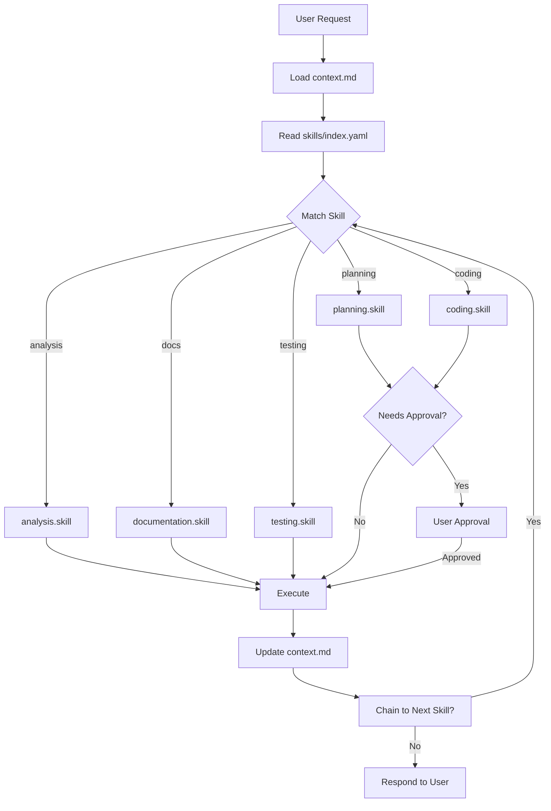

<div align="center">

# 🤖 Smart Copilot

### *Skill-Based AI-Assisted Development with Human Control*

[](https://opensource.org/licenses/MIT)
[](https://github.com/neyrojasj/planning-copilot)
[](https://github.com/features/copilot)

**A skill-based smart agent for GitHub Copilot that brings intentionality to AI-assisted development.**  
*Route to skills. Maintain context. Plan first. Approve consciously. Implement with confidence.*

[Quick Start](#-quick-start) • [Features](#-features) • [Architecture](#-skill-based-architecture) • [Skills](#-core-skills)

</div>

---

## ✨ Features

<table>
<tr>
<td width="33%" valign="top">

### 🎯 Skill-Based Routing
Requests are automatically routed to specialized skills based on intent. Each skill handles one domain expertly.

</td>
<td width="33%" valign="top">

### 🧠 Unified Context
Single `context.md` file maintains all project memory, session state, and user preferences.

</td>
<td width="33%" valign="top">

### 🔧 Auto-Generated Skills
Setup skill scans your project and generates custom skills based on detected patterns.

### 🧩 Gap-Aware Skill Coverage
For change requests, Smart first verifies a suitable skill exists. If none matches, it creates a project-specific skill, registers it, and then executes the request through that new skill.

### 🧪 Specialized Task Guardrail
If a request matches a broad skill but asks for an uncovered subtype (for example mutation or contract testing), Smart generates a dedicated subtype skill first, then executes through it.

</td>
</tr>
<tr>
<td width="33%" valign="top">

### ⛓️ Skill Chaining
Skills automatically chain together for complex workflows (planning → coding → testing).

</td>
<td width="33%" valign="top">

### 🛡️ Standards Enforcement
Built-in language standards for Rust, Node.js, C, C++, Go, and Python.

</td>
<td width="33%" valign="top">

### ✅ Approval Workflow
Planning and coding skills require explicit approval before implementation.

</td>
</tr>
</table>

---

## 🏗️ Skill-Based Architecture

```
┌─────────────────────────────────────────────────────────────────────────┐
│                        SMART ORCHESTRATOR                                │
│                                                                         │
│  1. Receive user request                                                │
│  2. Load context from .github/copilot/context.md                               │
│  3. Match request → Determine skill(s) needed                           │
│  4. Delegate to skill(s)                                                │
│  5. Update context.md with results                                      │
│  6. Return response to user                                             │
└─────────────────────────────────────────────────────────────────────────┘
                                │
        ┌───────────┬───────────┼───────────┬───────────┐
        ▼           ▼           ▼           ▼           ▼
┌───────────┐ ┌───────────┐ ┌───────────┐ ┌───────────┐ ┌───────────┐
│ Planning  │ │  Coding   │ │ Analysis  │ │   Docs    │ │  Testing  │
│   Skill   │ │   Skill   │ │   Skill   │ │   Skill   │ │   Skill   │
└───────────┘ └───────────┘ └───────────┘ └───────────┘ └───────────┘
```

---

## 🚀 Quick Start

### One-Command Installation

```bash
curl -sSL https://raw.githubusercontent.com/neyrojasj/planning-copilot/main/scripts/install.sh | bash
```

### Installation Options

| Option | Command |
|--------|---------|
| **Full Install** (with standards) | `curl ... \| bash` |
| **No Standards** | `curl ... \| bash -s -- --no-standards` |
| **Minimal** | `curl ... \| bash -s -- --minimal` |

### 📦 What Gets Installed

```
your-project/
├── .github/
│   ├── copilot-instructions.md  # 🤖 Auto-loads smart agent
│   ├── agents/
│   │   └── smart.agent.md       # 🎯 Orchestrator
│   └── skills/
│       ├── index.yaml           # Skill registry
│       ├── planning/SKILL.md
│       ├── coding/SKILL.md
│       ├── analysis/SKILL.md
│       ├── documentation/SKILL.md
│       ├── testing/SKILL.md
│       ├── setup/SKILL.md
│       └── skill-generator/SKILL.md
└── .github/copilot/
    ├── context.md               # 🧠 Project memory
    ├── session.md               # 📋 Session state
    ├── docs/                    # 📖 Project documentation
    ├── standards/               # 🛡️ Language standards
    ├── plans/                   # 📋 Implementation plans
    └── prompts/                 # 🎯 Setup prompts
```

---

## 📚 Core Skills

| Skill | Purpose | Triggers | Approval |
|-------|---------|----------|----------|
| **planning** | Create implementation plans, architectural decisions | plan, design, approach, strategy | ✅ Required |
| **coding** | Generate and modify code with standards | implement, add, fix, refactor | ✅ Required |
| **analysis** | Code review, debugging, explanations | analyze, explain, debug, why | ❌ None |
| **documentation** | Generate and update docs | document, docs, readme | ❌ None |
| **testing** | Create tests with mocking | test, coverage, mock | ❌ None |
| **setup** | Project initialization, docs generation | setup, initialize, configure | ❌ None |
| **skill-generator** | Detect patterns, generate custom skills | generate skills, rescan, create skill | ❌ None |

### Skill Chaining

| Workflow | Chain |
|----------|-------|
| **New Feature** | planning → coding → testing → documentation |
| **Bug Fix** | analysis → coding → testing |
| **Code Review** | analysis → documentation |
| **Refactor** | planning → coding → testing |

### Skill Generation Confidence Policy

When a request needs a capability that is not covered, Smart creates a project-specific skill using evidence from code and documentation.

- Smart inspects relevant source files and project docs before generating the skill
- Smart reports routing confidence as a numeric percentage (0-100%)
- If confidence is below 70%, Smart asks for explicit user confirmation before using the skill
- If user approves low-confidence use, Smart records that acceptance in context for traceability

---

## 🧠 Unified Context Memory

All context is maintained in a single `.github/copilot/context.md` file:

```markdown
# Agent Context Memory

> Last updated: 2026-02-01T10:00:00Z
> Active skill: coding
> Current task: Implementing user authentication

## Project Identity
- **Name**: my-api
- **Type**: web-api
- **Stack**: Node.js + Express
- **Stage**: development

## Current Session
### Pending Tasks
- [ ] Add JWT middleware (coding.skill)
- [ ] Write auth tests (testing.skill)

### Recent Actions
1. 10:00 - Routed to planning.skill - Created PLAN-001
2. 10:15 - User approved PLAN-001
3. 10:20 - Routed to coding.skill - Implementing...

## Learned Context
### User Preferences
- Prefers TypeScript strict mode
- Wants comprehensive error handling
```

---

## 🔧 Auto-Generated Skills

The setup skill automatically detects project patterns and generates custom skills:

| Pattern Detected | Generated Skill |
|------------------|-----------------|
| GraphQL schemas | `graphql/SKILL.md` |
| Database migrations | `database/SKILL.md` |
| CI/CD workflows | `devops/SKILL.md` |
| Kubernetes manifests | `kubernetes/SKILL.md` |
| i18n/l10n files | `localization/SKILL.md` |
| Next.js structure | `nextjs/SKILL.md` |
| And many more... | |

Run the skill generator:
```
@smart Generate skills for this project
```

During setup, Smart also creates a capability map and a skill proposal file at `.github/copilot/docs/skills-opportunities.md`.
Low-confidence skills are deferred as explicit gaps and generated later on first matching change request.
Skills generated from real requests are recorded under `Generated On Demand` with the request summary, subtype, and evidence.

---

## 🔄 Orchestrator Flow


```mermaid
graph TD
    A[User Request] --> B[Load context.md]
    B --> C[Read skills/index.yaml]
    C --> D{Match Skill}
    D -->|planning| E[planning.skill]
    D -->|coding| F[coding.skill]
    D -->|analysis| G[analysis.skill]
    D -->|docs| H[documentation.skill]
    D -->|testing| I[testing.skill]
    E --> J{Needs Approval?}
    F --> J
    G --> K[Execute]
    H --> K
    I --> K
    J -->|Yes| L[User Approval]
    J -->|No| K
    L -->|Approved| K
    K --> M[Update context.md]
    M --> N[Chain to Next Skill?]
    N -->|Yes| D
    N -->|No| O[Respond to User]
```

---

## 🛡️ Language Standards

When installed with standards, enforce best practices automatically:

| Standard | Language |
|----------|----------|
| `general.md` | Universal principles (always applied) |
| `rust.md` | Rust best practices |
| `nodejs.md` | Node.js/TypeScript best practices |
| `python.md` | Python best practices |
| `golang.md` | Go best practices |
| `c.md` | C best practices |
| `cpp.md` | C++ best practices |

### Documentation Expectations

Documentation is treated as part of the implementation.

- Update user-facing docs when behavior, APIs, or configuration changes
- Update public API docs/docstrings for signature or contract changes
- Keep examples and snippets synchronized with the current code
- Remove stale documentation in the same change that supersedes it

---

## 📋 Commands

| Command | Description |
|---------|-------------|
| `@smart setup project` | Initialize project with documentation |
| `@smart generate skills` | Scan and generate custom skills |
| `@smart plan <task>` | Create an implementation plan |
| `@smart implement <plan>` | Execute an approved plan |
| `@smart analyze <target>` | Review code or debug issues |
| `@smart document <target>` | Generate documentation |
| `@smart test <target>` | Create tests |

---

## 🗂️ Repository Structure

```
planning-copilot/
├── README.md                    # You are here
├── .github/
│   ├── copilot-instructions.md
│   ├── agents/
│   │   └── smart.agent.md       # 🎯 Orchestrator
│   ├── skills/                  # 📚 Canonical skills
│   │   ├── index.yaml
│   │   ├── planning/SKILL.md
│   │   ├── coding/SKILL.md
│   │   ├── analysis/SKILL.md
│   │   ├── documentation/SKILL.md
│   │   ├── testing/SKILL.md
│   │   ├── setup/SKILL.md
│   │   └── skill-generator/SKILL.md
│   └── copilot/                 # 📋 Templates (at destination paths)
│       ├── context.md           # 🧠 Project memory template
│       ├── session.md           # 📋 Session state template
│       ├── instructions.md      # 📝 Project instructions template
│       ├── gitignore.txt        # 🚫 Gitignore template
│       ├── docs/                # 📖 Documentation templates
│       │   ├── index.yaml
│       │   ├── overview.md
│       │   ├── architecture.md
│       │   ├── tech-stack.md
│       │   ├── conventions.md
│       │   ├── development.md
│       │   ├── testing.md
│       │   ├── api.md
│       │   └── decisions/
│       ├── plans/
│       │   └── state.yaml       # 📊 Plan tracking template
│       ├── prompts/             # 🎯 Setup prompts
│       │   ├── setup-project.md
│       │   ├── code-audit.md
│       │   └── generate-skills.md
│       └── standards/           # 🛡️ Language standards
│           ├── general.md
│           ├── markdown.md
│           ├── rust.md
│           ├── nodejs.md
│           ├── python.md
│           ├── golang.md
│           ├── c.md
│           └── cpp.md
└── scripts/
    ├── install.sh               # Main installer
    ├── install-with-standards.sh
    └── install-minimal.sh
```

---

## 🤝 Contributing

1. 🍴 **Fork** the repository
2. 🌱 **Create** a feature branch
3. 💻 **Make** your changes
4. ✅ **Test** thoroughly
5. 📤 **Submit** a pull request

### Ideas for Contributions

- Add new skill templates
- Add standards for more languages
- Improve skill routing logic
- Add more auto-detection patterns

---

## 📄 License

**MIT License** - See [LICENSE](LICENSE) for details.

---

<div align="center">

> *"Route to skills, maintain context, implement with confidence."*

### Made with ❤️ for developers who value intentionality in the AI era

[](https://github.com/neyrojasj/planning-copilot)

</div>
